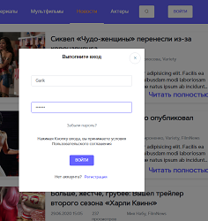

# FilmFinity

### Целью написания данного проекта было приобретение практических навыков работы с фреймворком Vue путем создания SPA.

## Created with
- Node.js
- ASP NET Core
- Vue.js
- VueRouter
- Vuex

## Clone
- Clone this repo to your local machine using 
``` 
https://github.com/IgorNazaryok/film-finity
```

## Features
- New user registration
- User authorization
- Celebrity Page
- News page
- Movies page
- Series page
- News page
- Movie page
- Favorites page
- Site localization
---
## Example
[](./image/registration.png)
[](./image/autorizations.png)
[](./image/movies.png)
[](./image/serials.png)
[](./image/news.png)
[](./image/actors.png)
[](./image/singers_m.png)
[](./image/favorites.png)
<br>

## Authors
- `Белохвостов Даниил`
- `Покусаев Вячеслав`
- `Волковский Владислав`
- `Малый Ярослав`
- `Назарёк Игорь`
- `Никоненко Ярослав`

## Лицензия
Этот проект лицензируется в соответствии с лицензией MIT.

## Contact Information
**Nazaryok Igor** <br>
e-mail: igor.nazarek@gmail.com