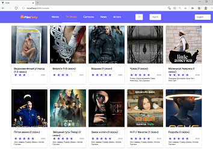
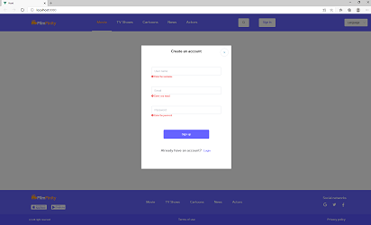
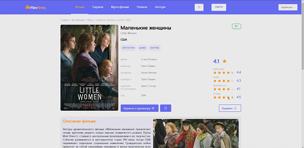
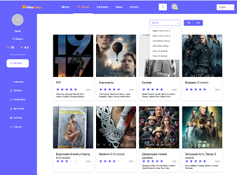

>**_FilmFinity_** is a movie database and website. The database contains information about films, television series, as well as information about actors, directors, screenwriters and other personalities associated with the world of cinema.<br>
On the site, unauthorized users have the opportunity to get acquainted with the latest news feed, view the latest additions of new films and series. Also on the site there is a page dedicated to the stars of the cinema.
The site is localized for three languages ​​- Russian, Ukrainian and English.
Any interested user of the site can register. After registration and authorization on the site, the user's personal account is available with a section of selected films and series.

## Created with
- Node.js
- ASP.NET Core
- Vue.js
- VueRouter
- Vuex

## Clone
- Clone this repo to your local machine using 
``` 
https://github.com/IgorNazaryok/film-finity
```

## Features
- New user registration
- User authorization
- Movies page
- Series page
- News page
- Celebrity page
- Movie page
- Favorites page
- Site localization
---
## Demo


> ### Unauthorized users
For unauthorized users, only viewing pages of films, TV series, news and pages of stars is available.

[](https://youtu.be/gv6qO4vIYAA)

> ### Localization

The site is localized in three languages ​​- English, Russian and Ukrainian.
Translated menu, footer, static fields, except for the main content.


[](https://youtu.be/FIVBEtxHNKs)

> ### Registration & Sing In
When registering, the fields are validated for filling, the email field is email, the email is unique - there is no user with such an email. If the filling is incorrect, a corresponding message is displayed.

Upon entering the site, a check is made to fill in the fields. If you enter incorrect data, a corresponding message is displayed.


[](https://youtu.be/EBFG5TM_b0k)

> ### Page Movie
On the Movies page, you can see the available list of movies. You can also view a separate movie card.


[](./image/movies.png)
[](https://youtu.be/J5kFO6vAi6Q)

> ### Page TV Shows
On the Serials page, you can get acquainted with the available list of serials.


[](./image/serials.png)

> ### Page News
A selection of news from the world of cinema has been created on the News page.


[](./image/news.png)

> ### Page Actors
The actors' page contains the stars of world cinema. On the page you can find information on each star - photo, profession, as well as the number of views of the card for this star.


[](./image/actors.png)

> ### Favorite & Reviews
Favorite & Reviews is a functionality that is available after entering the site. On the registration and review page, filtering by 6 categories and page-by-page panigation are implemented. Additionally, on the review page, a search line for the required news is implemented.

[](https://youtu.be/dS2KJ8D23K0)
[](https://youtu.be/B2S4Oz2wNWM)


>## Example screenshots of pages

[**Click to view**](https://youtu.be/kxw8h7P81j8)

[](https://youtu.be/kxw8h7P81j8)
<br>


## Contact Information
**Nazaryok Igor** <br>
e-mail: igor.nazarek@gmail.com